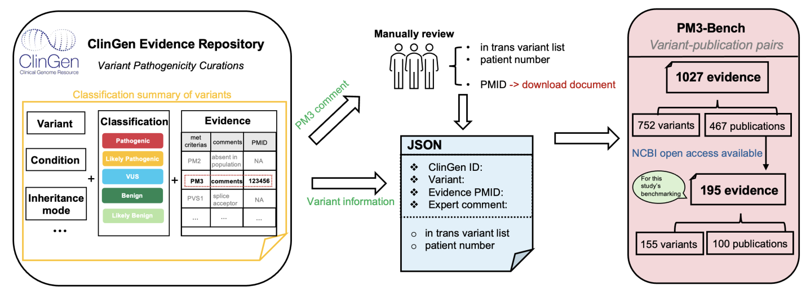

# PM3-Bench

## Introduction
The [ClinGen Evidence Repository](https://erepo.clinicalgenome.org/evrepo/)  provides expert-curated assertions, they are written in plain English, posing a difficult challenge for automated evaluation of benchmarks. To address this, we created PM3-Bench, a comprehensive dataset for PM3 literature evidence extraction, based on the ClinGen Evidence Repository

---

## Description
We provide the `PM3-Bench.json` in this repo, which includes the following fields:
| Column Name | Description | 
|---| --- |
| ClinGen ID | The original ID in the ClinGen Evidence Repository |
| Variant Name | The HGVS name of the variant (DNA change) |
| Condition | The condition reported in ClinGen |
| Criterion | The met ACMG criteria |
| Raw Comment |The expert-submitted comment |
| PMID | The PubMed ID of the literature evidence  |
| Number of Patients | Extracted number of patients based on the comments |
| In trans Variants  | List of in trans variants extracted from the comments, augmented in all possible formats, separated by space. "NA" means no in trans variant was mentioned in the raw comments |
| labels | `eval`: variant-publication pairs for evaluations; `others`: truncated publication XML file in NCBI API, removed in evaluation; `fine-tune`: remaining samples, where non-empty comments used for fine-tuning|

