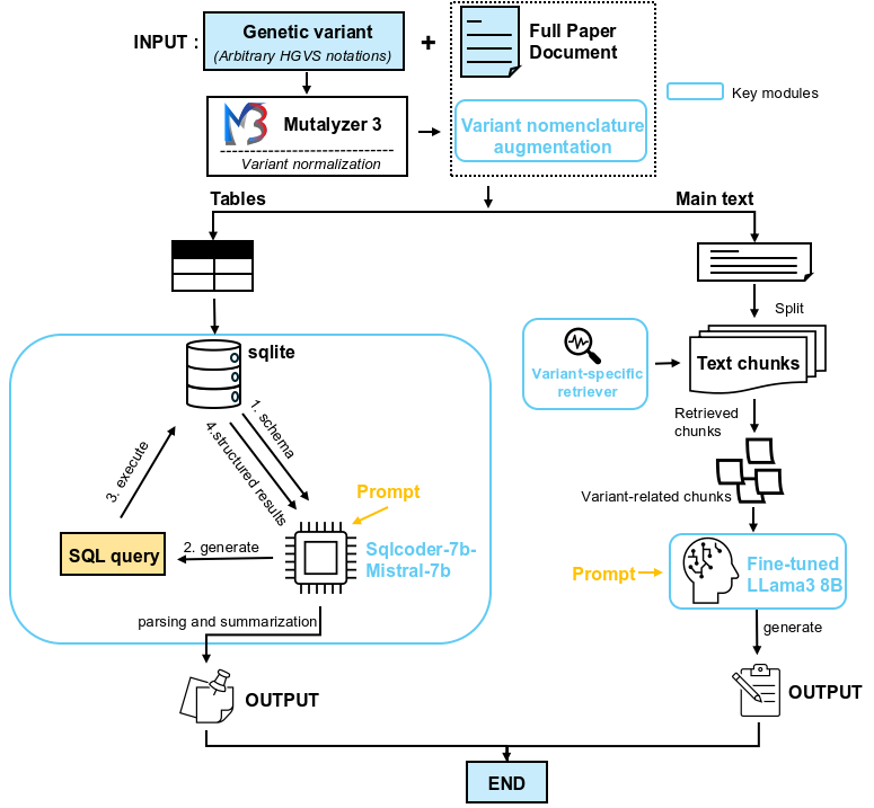

# AutoPM3: Enhancing Variant Interpretation via LLM-driven PM3 Evidence Extraction from Scientific Literature

[](https://opensource.org/license/mit/) 
[](https://doi.org/10.5281/zenodo.15629003)


Contact: Ruibang Luo, Shumin Li

Email: rbluo@cs.hku.hk, lishumin@connect.hku.hk


## Introduction
We introduce AutoPM3, a method for automating the extraction of ACMG/AMP PM3 evidence from scientific literature using open-source LLMs. It combines an optimized RAG system for text comprehension and a TableLLM equipped with Text2SQL for data extraction. We evaluated AutoPM3 using our collected PM3-Bench, a dataset from ClinGen with 1,027 variant-publication pairs. AutoPM3 significantly outperformed other methods in variant hit and in trans variant identification, thanks to the four key modules. Additionally, we wrapped AutoPM3 with a user-friendly interface to enhances its accessibility. This study presents a powerful tool to improve rare disease diagnosis workflows by facilitating PM3-relevant evidence extraction from scientific literature.

AutoPM3's manucript describing its algorithms and results is at [BioRxiv](https://www.biorxiv.org/content/10.1101/2024.10.29.621006v1)


---

## Contents

- [Latest Updates](#latest-updates)
- [Online Demo](#online-demo)
- [Installations](#installation)
    - [Dependency Installation](#dependency-installation)
    - [Ollama Setup](#using-ollama-to-host-llms)
- [Usage](#usage)
    - [Quick Start](#quick-start)
    - [Advanced Usage](#advanced-usage-of-the-python-script)
- [PM3-Bench](#pm3-bench)
- [TODO](#todo)
---

## Latest Updates
* v0.1 (Oct, 2024): Initial release.
---
## Online Demo
* Check out our online demo: [AutoPM3-demo](https://www.bio8.cs.hku.hk/autopm3-demo/). Please note, due to limited computing resources, we recommend deploying AutoPM3 locally to avoid long queuing times.
## Installation
### Dependency Installation
```bash
conda create -n AutoPM3 python=3.10
conda activate AutoPM3
pip3 install -r requirements.txt
```

### Using Ollama to host LLMs
1. Download Ollama [Guidance](https://github.com/ollama/ollama)  
2. Change the directory of Ollama models:
```bash
# please change the target folder as you prefer
mkdir ollama_models
export OLLAMA_MODELS=./ollama_models
```


```bash

ollama serve

```

3. Download sqlcoder-mistral-7B model and fine-tuned Llama3:
```bash
cd $OLLAMA_MODELS
wget https://huggingface.co/MaziyarPanahi/sqlcoder-7b-Mistral-7B-Instruct-v0.2-slerp-GGUF/resolve/main/sqlcoder-7b-Mistral-7B-Instruct-v0.2-slerp.Q8_0.gguf?download=true
mv 'sqlcoder-7b-Mistral-7B-Instruct-v0.2-slerp.Q8_0.gguf?download=true' 'sqlcoder-7b-Mistral-7B-Instruct-v0.2-slerp.Q8_0.gguf'
echo "FROM ./sqlcoder-7b-Mistral-7B-Instruct-v0.2-slerp.Q8_0.gguf" >Modelfile1
ollama create sqlcoder-7b-Mistral-7B-Instruct-v0.2-slerp.Q8_0 -f Modelfile1

wget http://bio8.cs.hku.hk/AutoPM3/llama3_loraFT-8b-f16.gguf
echo "FROM ./llama3_loraFT-8b-f16.gguf" >Modelfile2
ollama create llama3_loraFT-8b-f16 -f Modelfile2

```

5. Check the created models:

```bash

ollama list

```

6. (Optional) Download other models as the backend of the RAG system:
```
# e.g. download Llama3:70B
ollama pull llama3:70B

```

## Usage

### Quick start

* Step 1. Launch the local web-server:
```bash
streamlit run lit.py
```
* Step 2. Copy the following `http://localhost:8501` to the brower and start to use.

### Advanced usage of the python script

* Check the help of AutoPM3_main.py
```bash
python AutoPM3_main.py -h
```
* The example of running python scripts: 
```bash
python AutoPM3_main.py 
--query_variant "NM_004004.5:c.516G>C" ## HVGS format query variant
--paper_path ./xml_papers/20201936.xml ## paper path.
--model_name_text llama3_loraFT-8b-f16 ## change to llama3:70b or other hosted models as the backend of RAG as you prefer, noted that you need pull the model in Ollama in advance.
```

## PM3-Bench
* We released PM3-Bench used in this study, details listed in [PM3-Bench tutorial](PM3-Bench/README.md)

## TODO
* A fast set up for AutoPM3.
